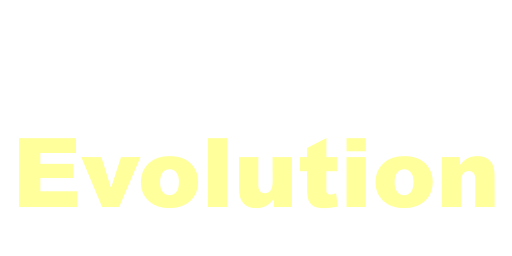

    

Generate your creatures and watch them evolve through the generations!

 

  

  

---

# How it works

When you begin, 100 creatures are randomly generated. Creatures are made up of nodes (circles) and muscles (lines). When a creature is generated, a set of attributes are created which define how its muscles move, and when.

Creatures are given 15 seconds to go as far to the right as possible. The top 50% of creatures give offspring, and the other half dies off. 

This allows for natural selection which makes creatures converge to go farther and farther over time.

# Technology

We used Rust for this project since it's lightweight and memory-safe. For physics, we used the physics engine [Rapier](https://rapier.rs/). For UI, we used [egui](https://github.com/emilk/egui) and [eframe](https://github.com/emilk/egui/tree/master/crates/eframe).

# Contributors

Created by Timothy, Numair, Shivjeet, and Marcus.

See [statistics](https://github.com/ProjEvo/project-evolution/graphs/contributors).
